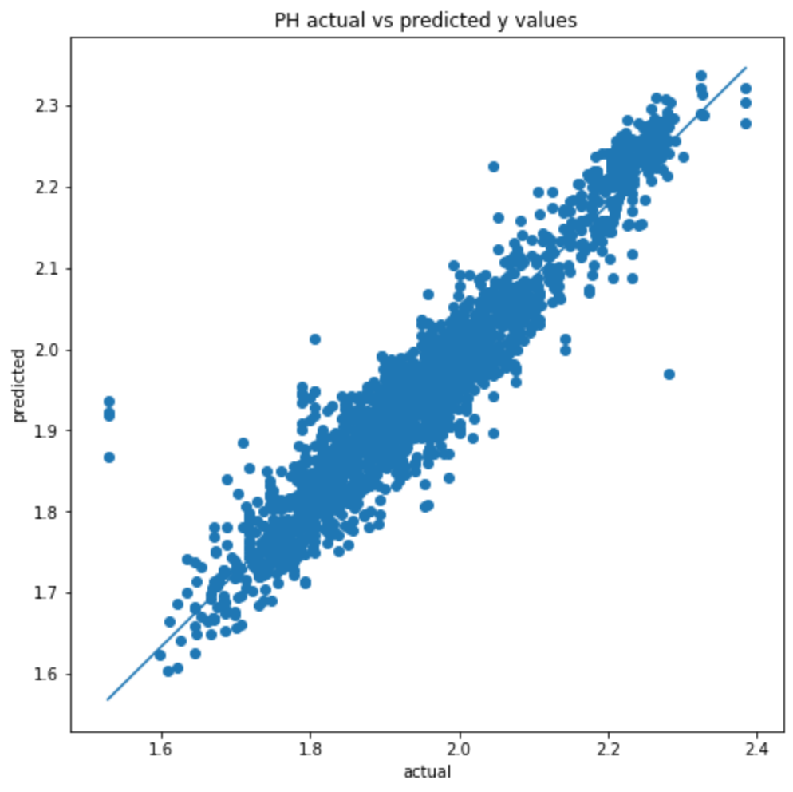

# Predicting Soil Nutrition with Infrared Spectroscopy

[photo by Malherbe Rossouw, South Africa ](https://commons.wikimedia.org/w/index.php?curid=63653257)

## Motivation:

Soil health is our health. Here we hope to improve our tools of assessing soil health and making them more available. Best ecological practices of agriculture can be measured and their efficacy can be proven. Here we are building the ability to use a cheap and quick method of soil health assessment such as a infrared scanning. Infrared scanning could be made widespread in smartphones. 

Infrared spectroscopy has traditionally provided great scientific insight. Here we can see how it can improve the quality of life of farmers and the whole ecosystem.

My hope is this project begins what could become a predictive model robust enough to inform cruder handheld infrared scannings, by considering global and local datasets particular to that location. Such a device/application could democratize soil health and demystify the process of knowing your soil's nutrient profile. Another horizon of interest would be considering ways to easily assess soil microbiology.

## Data Source

Data Collected between 2009 and 2013 by [African Soil Information Service (AFSIS)](https://registry.opendata.aws/afsis/) research centers.

Sponsored by:

[QED homepage](https://qed.ai/)

[Data Tutorial](https://github.com/qedsoftware/afsis-soil-chem-tutorial)

## Infrared Spectroscopy: Overview

Infering nutrients through Infrared Spectroscopy. Thousands of soil samples have been both scanned with (dry testing) and tested in the lab (wet testing), for a more complete soil profile. The goal is to predict the more detailed nutrient profile by using the coarser, but more efficient and affordable, infrared methods.

## How the Data Was Collected

3 Research Centers Across Africa: CROPNUTS, ICRAF, and RRES. I worked primarily with CROPNUTS due to them having large data set available.

Each research center performed dry teting (infrared and xray scanning) and wet testing (chemical extraction and solutions) on soil sampled from the same sights across the continent.

## How the Data was Measured:

One infrared scanning tool, the Bruker HTS-XT

[more information on Bruker HTS-XT](https://www.bruker.com/products/infrared-near-infrared-and-raman-spectroscopy/ft-ir-routine-spectrometers/hts-xt.html)

The infrared scanner can be configured in a variety of ways, target different spectra ranges:

The data includes scannings from a variety of infrared methods (LIST). Different tools are suitable for different ranges in the infrared spectrum. Considering which tool to use to measure the soil impacts which particles they are able to perceive. For soil nutrient molecules near the soil surface, all the infrared tools performed decently. For aspects of the soil harder to depict physically, such as soil eletrical capacitance due to insoluable salt buildup (CONFIRM), certain tools perform better than others.

A research paper considers this more closely:

## The Data

## XGBoost Model Trained on Bruker HTS-XT Data

### Training the Model

## Nutrient Predictions

### Calcium

### Magnesium

### Potassium

### Phosphorus

### Soil pH

## Next Steps:

Considering geodata in the model. Attempting transfer learning on neural networks using data from other continents.